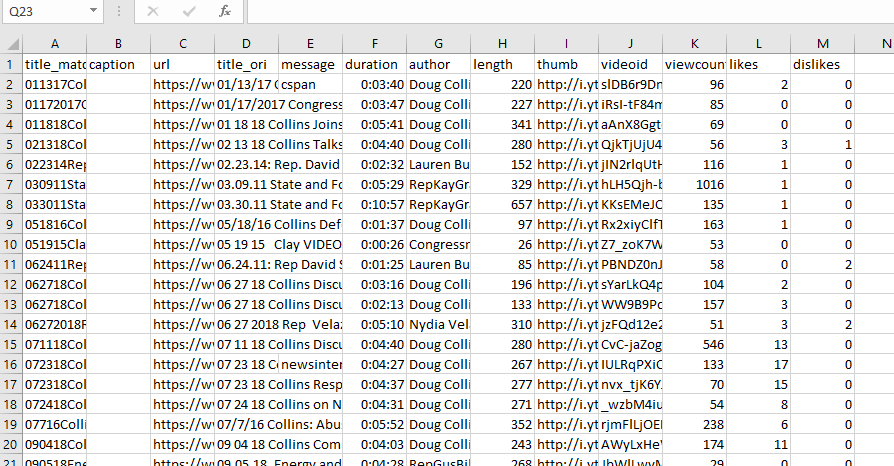
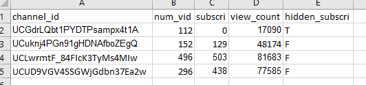
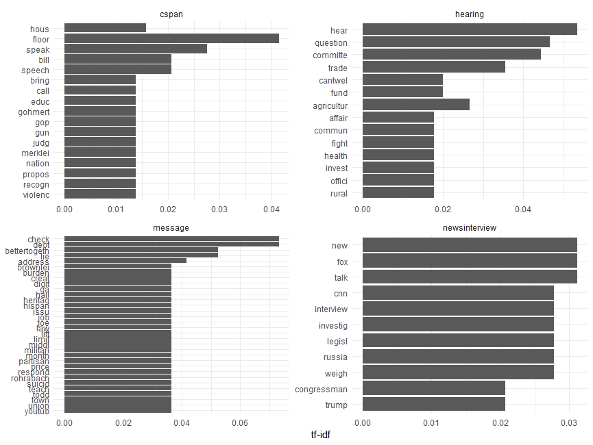
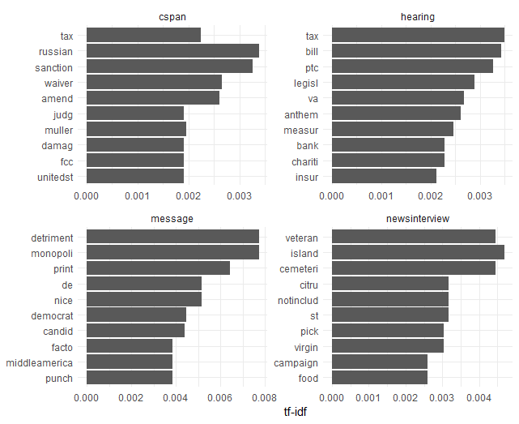
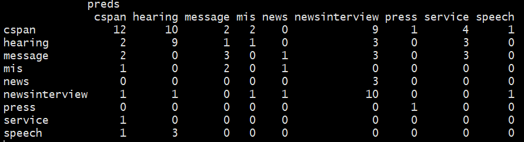
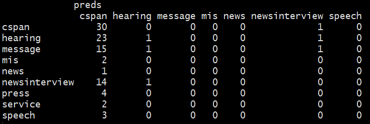
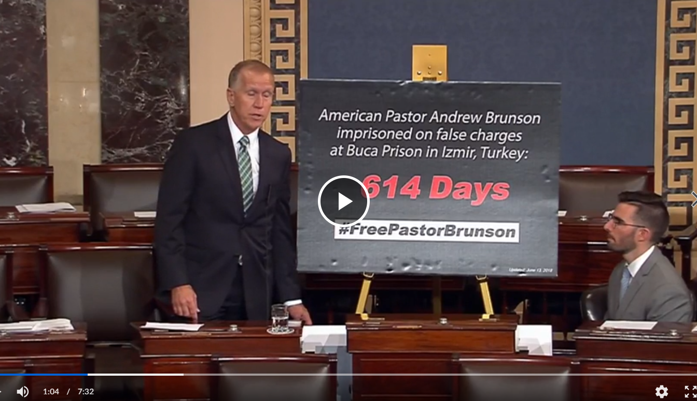
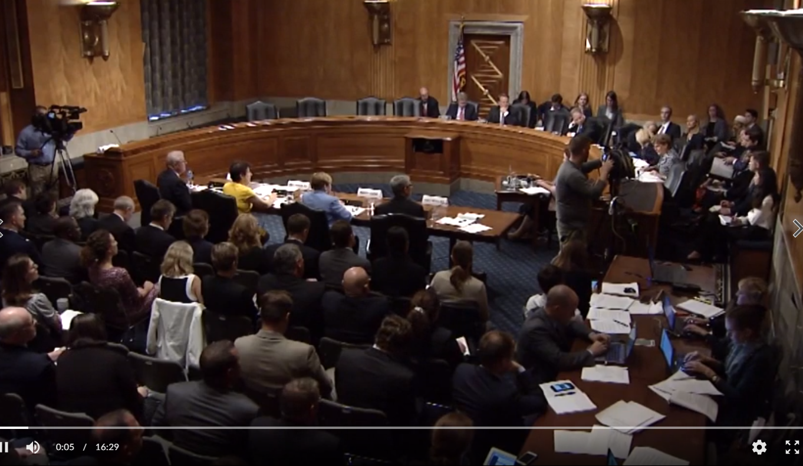
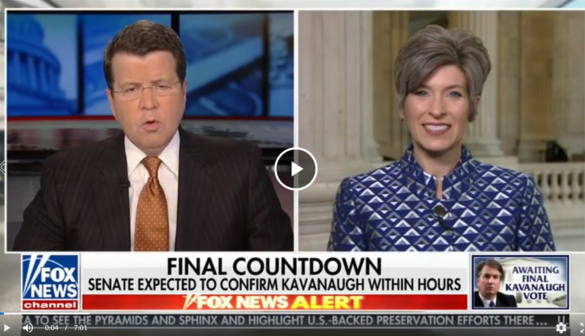
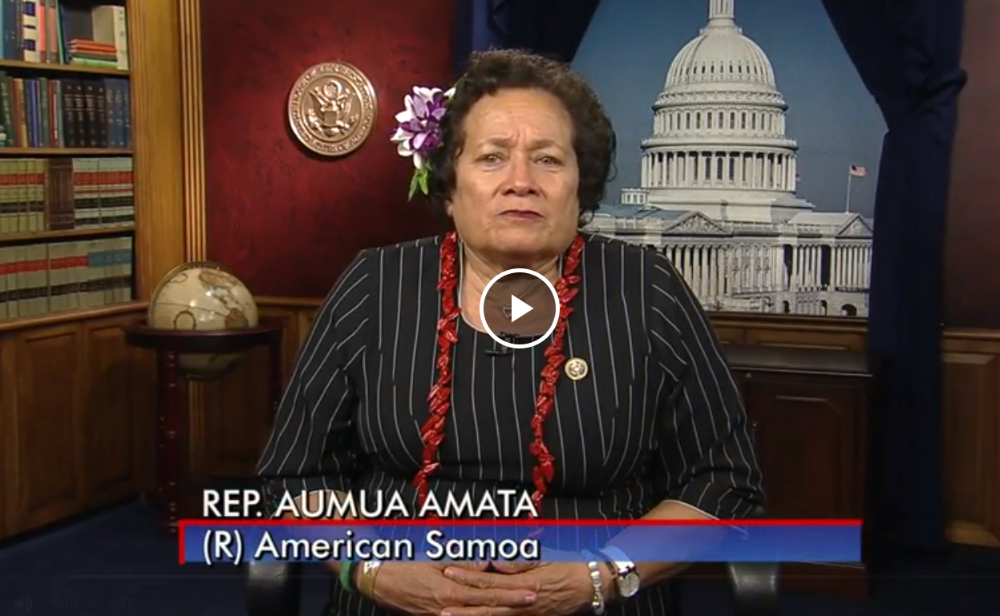

# Politicians in Youtube: How do they use their Youtube Channel? User-centered videos

How do politicians use their Youtube channel? I argue that politicians use their Youtube channel to communicate with their core supporters who closely follow legislative speech and behaviors. Compared to other media outlet often used by politicians such as Twitter or Facebook, Youtube videos in politicians' channels are more focsued on their floor speech or policy-focused messages.

In this project report, I mainly focus on explaining data collection, metadata and data in detail. The Youtube project can be developed in various aspects, but the important point of this project is collecting Youtube data. Therefore, I will focus on data part only in here. The data can help to understand many important questions. Which politicians use Youtube for what purposes? Are politicians’ Youtube contents different from their other media outlets such as Twitter and Facebook? How do politicians use their Youtube channel? How do politicians use emotions to affect audience? How do politicians use images? What is politicians’ campaign strategy? 

This report is focused on the collection of data and classification for futuer direction of our research.
Please find my presentaiton file [here](https://github.com/HungryLim/Communication-in-Youtube-user-centered-videos/blob/master/Youtube_proj_presentation.pdf) and report in [here](https://github.com/HungryLim/Communication-in-Youtube-user-centered-videos/blob/master/Youtube_proj_report.pdf).

# Motivation
* Youtube is one of the major information sources
* Little known about how legislators show themselves in their Youtube Channel
* Video has many features including text, image and audio

# Literature
* Scholars have studied political advertising in Youtube, but they have not focused how legislators use their Youtube channels overall. 
* Systematic analysis of large scale Youtube data is not done.
    * Klotz 2010; Lev-On 2012; Borah, Porismita, Erika Fowler, and Ridout 2018

# Goals: data
* Short term goal
Find descriptive statistics: channel data and video data
  * video.id, post.time, title, duration, view.count, like.count, dislike.count, comment, transcript etc
* Long term goal
download video, download transcript for analysis

# Research questions
* Short term goals
  * Which politicians use Youtube for what purposes?
  * Are politicians' Youtube contents different from their other media outlets such as Twitter and Facebook?

* Long term goal
  * How do politicians use emotions to affect audience? 
  * How do politicians use images?
  * What is politicians' campaign strategy?
  
  
# Data collecting process
The Python script for data collection is in [here](https://github.com/HungryLim/Communication-in-Youtube-user-centered-videos/blob/master/collectiong.py)
* Videos and transcripts
  * Using all legislators' available Youtube channel id, I scrapped the videos urls. (Python package Youtube_dl)
  * Download data to local drive and convert them (FFmpeg)
  * Move the data to Box cloud drive (FTP protocol)
  * Using Cluster to finish the looping (write cluster in WashU Center for High Performance Computing)

* Descriptive data of videos
   * Youtube API
   * Other Python packages 

# Data
The meta data will be two parts: Channel data and video data. Channel data have channel id, view count, subscriber count and video count. Video data have title, url, duration, author, thumbnail, video id, view count, likes and dislikes. To get channel meta data, I need to use Youtube API because Youtube\_dl does not provide these information. 

With this channel data, we can study who uses Youtbe more than other legislators for what purposes. The subscriber data and number of video data might be useful although the comparison among legislators using this information should be cautious. It is because some legislators have been in there office longer than others. However, this channel data can be useful meta data for further analysis by using video data.

With video meta data, we can investigate various questions. What types of videos are more popular than the others? What types of videos are uploaded in their youtube channel? More generally we can study how politicians use their Youtube channel different from their Twitter and Facebook. These questions are little explored in political science literature.

* Goal: All legislators' available Youtube data from their channels
  * Total 484 legislators (House and Senate) as of 2018 October
  * 14265 URLs
  * 5871 videos
  * 5155 transcripts (captions)
  * Total about 300 GB

# Outline of processed data

  
  
   
    <em>Video metadata&emsp;&emsp;&emsp;&emsp;&emsp;&emsp;&emsp;&emsp;&emsp;&emsp;&emsp;&emsp;&emsp; Channel metadata</em>

                                                                                                              
                                                                                                               
# Data: transcript (caption)                                                                                                         
Rep. House Todd Young (current Senator) on Gun control. [Link](https://www.youtube.com/watch?v=T3NDoxKH_fU)

Transcript: 

hello and welcome to our latest edition of talking with Todd an opportunity for me to periodically share with you my thoughts on important issues before Congress and to discuss topics which are important to Hoosiers today I'll focus on some of the proposals to reduce gun violence that have been discussed in recent weeks many of you have called or in the office to ask where I stand thank you let's not mince words I'm a strong supporter of the Second Amendment and I have an A rating with the National Rifle Association while I can support measures to keep guns out of the hands of criminals I will not support any legislation that infringes on the
ability of law-abiding citizens to exercise their constitutionally guaranteed right to the legal gun ownership the Supreme Court has made it clear that the Second Amendment right to keep and bear arms is an explicitly ......

# Method for classification
* Goal: Classifying types of videos
* Method: supervised learning: random forest
  * Hand-coded 200 videos: 9 types
    * cspan, hearing, message, mis, news, newsinterview, press, service, speech 
  * Create document-term matrix
  *  Exploratory analysis: chart
  * Train the model (using video title or transcript)
  * Test the model

# Exploratory analysis: using title

  
   
    <em>Frequent keywords from video title</em></em>

# Exploratory analysis: using transcript

    
     
    <em>Frequent keywords from video transcript</em>

# Prediction: using title
35 percent accuracy

     
   <em>Prediction of classification success rate: using title</em>

# Prediction: using transcript
31 percent accuracy

     
   <em> Prediction of classification success rate: using transcript</em>

# Classification results
* Using title shows better accuracy than using transcript based on random forest model.
* Random forest model may not be the best model.
* There are problems in hand-coding.
   * Too many different classifier and subtle differences.
   * Only 100 train data set and 100 test data set
   * Unsupervised learning may work better.

  
  
   
    <em>Video metadata&emsp;&emsp;&emsp;&emsp;&emsp;&emsp;&emsp;&emsp;&emsp;&emsp;&emsp;&emsp;&emsp; Channel metadata</em>

  
  
   
    <em>Video metadata&emsp;&emsp;&emsp;&emsp;&emsp;&emsp;&emsp;&emsp;&emsp;&emsp;&emsp;&emsp;&emsp; Channel metadata</em>

For the class, I use supervised learning method to classify videos. First, I hand-coded 100 videos of test set data to classify them with 9 types: cspan, hearing, message, mis, news, newsinterview, press, service and speech. This is my arbitrary coding method. From randomly selecting videos, in my observation, there are largely four types of videos in legislators' Youtube channel: C-SPAN, hearing, news interview of the legislator and message to Youtube viewers.

In the future, we should use unsupervised learning to classify video type by using transcription data. When I used random forest model for supervised learning with 100 hand-coded training set and 100 test data, the accuracy was quite low. The accuracy rate with transcript was about 31 percent, and the accuracy rate with title of video was about 35 percent. The accuracy might be low because of following reasons: first, the training data and test data were too small. Second, the 9 types of video that I arbitrarily created are too many. Third, random forest model is not the best method to classify these kind of data. 

# Findings and implications
* Most videos in legislators' channels are cspan videos (about 51 percent).
* Unlike Twitter messages or Facebook posts, Youtube video contents are more focused on floor speech (cspan), policy-focused messages, news media interview, and congressional hearing.
   * Overall, the messages and contents are more professional and complex than Twitter or Facebook posts that have a wider range of audience (general public). 
* This video contents in Youtube suggest that the subscribers, listeners, or followers of legislators' channels are more likely to be the core supporters and people who have higher political knowledge. 
* This can also implies that the reason why the video contents are more focused on cspan and other "pre-made" video contents (news interview, congressional hearing) is the cost of making video contents are more expensive than other media contents such as Twitter or Facebook. This could mean that the Youtube contents are more focused on more professional messages just because of the legislators' cost-benefit calculation of their media strategies.

# Future direction
Data
* Scrap all videos from given Channels
* Use unsupervised learning models
* Get comments data from each videos

